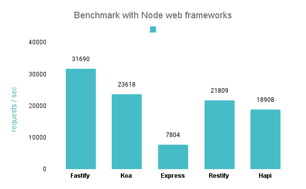

# Servidor REST HTTP

Este projeto foi desenvolvido utilizando o Nodejs e Fastify. O Fastify é um framework web para Nodejs que permite criar servidores HTTP de alta performance e baixo consumo de memória. O Fastify é um framework que utiliza o conceito de plugins, que são funções que adicionam funcionalidades ao framework. O Fastify possui uma grande comunidade e uma grande quantidade de plugins, o que facilita o desenvolvimento de aplicações web.

Utilizamos nesse projeto a arquitetura REST que padroniza a comunicação entre aplicações web. A arquitetura REST é baseada em requisições HTTP, que são feitas através de verbos HTTP. Os verbos HTTP mais utilizados são GET, POST, PUT e DELETE. O GET é utilizado para buscar informações, o POST é utilizado para criar novos dados, o PUT é utilizado para atualizar dados e o DELETE é utilizado para deletar dados.

O servidor HTTP é responsável por comunicar-se com o banco de dados e com o frontend. O servidor HTTP recebe as requisições HTTP do frontend e as responde com os dados do banco de dados. O servidor HTTP também recebe as requisições HTTP do banco de dados e as responde com os dados do frontend.

Neste projeto, utilizamos um ORM chamado Prisma com integração com o PostgreSQL, que é um banco de dados relacional. O ORM é uma biblioteca que permite que o desenvolvedor utilize uma linguagem de programação para se comunicar com o banco de dados. O ORM é responsável por traduzir as requisições HTTP do servidor HTTP para comandos SQL do banco de dados. O ORM também é responsável por traduzir os dados do banco de dados para objetos JavaScript que podem ser utilizados pelo servidor HTTP. O Prisma JS é um ORM que possui integração com o PostgreSQL e com o Nodejs.

### Web frameworks benchmark

A escolha pelo Fastify se dá pelo motivo de que ele é um framework web que possui uma performance muito boa. O Fastify possui uma performance melhor que o Express, que é um framework web muito popular. O Fastify possui uma performance melhor que o Express porque ele utiliza o conceito de plugins, que são funções que adicionam funcionalidades ao framework. O Fastify possui uma grande comunidade e uma grande quantidade de plugins, o que facilita o desenvolvimento de aplicações web.

	

